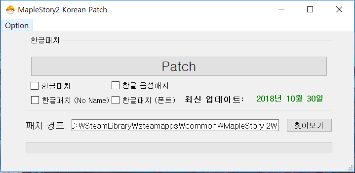
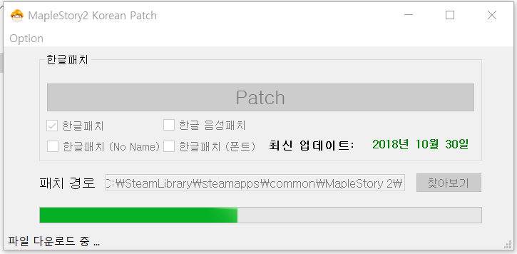

## 스팀(글로벌) 메이플스토리2 한글패치

Maple2_kor_patch 프로그램은 스팀(글로벌) 메이플스토리2를 이용하는 국내 유저분들의 한글 패치를 돕기 위해 개발됐습니다.

## Update History

* 11월 1일 오전 4시 15분 업데이트 완료 ( Version = 1.01)

드롭박스 urllib 연결

* 11월 12일 오전 11시 16분 업데이트 완료 ( Version = 1.1 )

구글 드라이브 연결 및 사운드 패치 트래픽 초과 해결완료, 프로그램 업데이트 기능의 버전 인식 수정

## 필수 라이브러리
* PyQt5
* beautifulsoup4
* bs4
* urllib3
* wget

## 실행 화면

